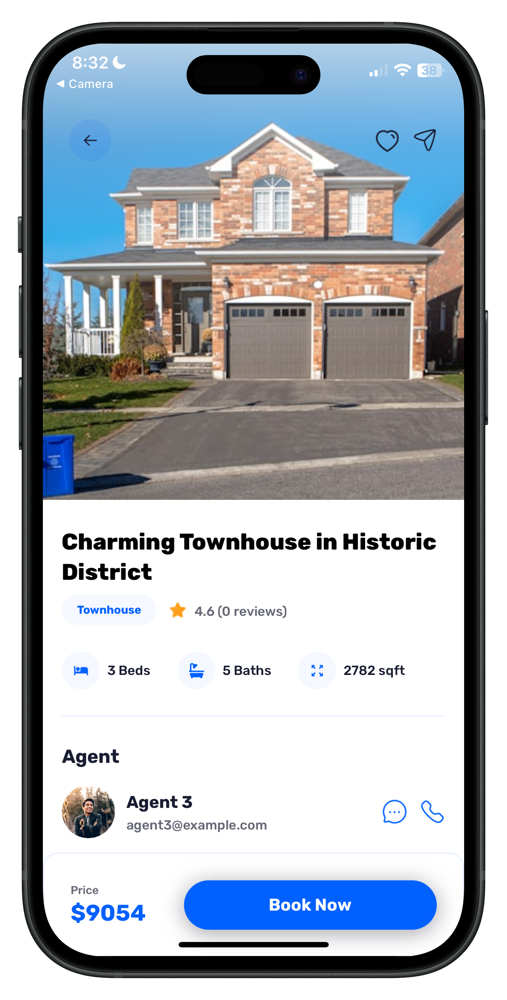

# Real Estate Mobile App aka HouseHunter (Front-end)

Welcome to the repository for the **Real Estate Mobile App**, a frontend application built using **React**. This app showcases a seeded real estate platform where users can browse properties, view detailed information about each house, and authenticate using **Google Authentication**.

## ScreenShots : 
<div style="display: flex; align-items: center; gap: 10px;">
  
  
  
  
  
</div>

## Table of Contents

- [Overview](#overview)
- [Features](#features)
- [Technologies Used](#technologies-used)
- [Installation](#installation)
- [Usage](#usage)
- [Google Authentication](#google-authentication)
- [Folder Structure](#folder-structure)
- [Contributing](#contributing)

## Overview

This project is a **frontend-only** real estate mobile application built with React. It allows users to explore a list of seeded properties, each with its own detail page. The app integrates **Google Authentication** to provide a seamless login experience for users.

## Features

- **Property Listings**: Browse a list of seeded real estate properties.
- **Property Details**: View detailed information about each property, including images, descriptions, and key features.
- **Google Authentication**: Securely log in using your Google account.
- **Responsive Design**: Optimized for mobile devices with a clean and intuitive user interface.

## Technologies Used

- **React**: A JavaScript library for building user interfaces.
- **React Router**: For handling navigation and routing within the app.
- **Google Authentication**: For user authentication using Google OAuth.
- **CSS/SCSS**: For styling the application.
- **Axios**: For making API calls (if integrated with a backend in the future).
- **React Icons**: For adding icons to the UI.

## Installation

To run this project locally, follow these steps:

1. **Clone the repository**:
   ```bash
   git clone https://github.com/your-username/real-estate-app.git

Navigate to the project directory:
bashCopycd real-estate-app

Install dependencies:
bashCopynpm install


## Start the development server:
bashCopynpm start

Open the app:

The app should open automatically in your default browser at http://localhost:3000.


## Usage

Home Page: Displays a list of seeded properties. Click on any property to view its details.
Property Detail Page: Shows detailed information about the selected property, including images, descriptions, and features.
Google Authentication: Click the "Login with Google" button to authenticate using your Google account.

## Google Authentication
The app integrates Google Authentication to provide a secure and seamless login experience:

Users click the "Login with Google" button.
They are redirected to Google's OAuth consent screen.
After granting permission, users are authenticated and redirected back to the app.

Folder Structure
Copyreal-estate-app/
├── public/                  # Static assets
├── src/
│   ├── components/          # Reusable UI components
│   ├── pages/               # Page components (Home, PropertyDetail, etc.)
│   ├── assets/              # Images, icons, and other static files
│   ├── styles/              # CSS/SCSS files
│   ├── utils/               # Utility functions (e.g., authentication helpers)
│   ├── App.js               # Main application component
│   ├── index.js             # Entry point of the app
│   └── .env                 # Environment variables (e.g., Google Client ID)
├── package.json             # Project dependencies
└── README.md                # This file

## Contributing
Contributions are welcome! If you'd like to contribute to this project, please follow these steps:

Fork the repository.
Create a new branch (git checkout -b feature/YourFeatureName).
Commit your changes (git commit -m 'Add some feature').
Push to the branch (git push origin feature/YourFeatureName).
Open a pull request.
